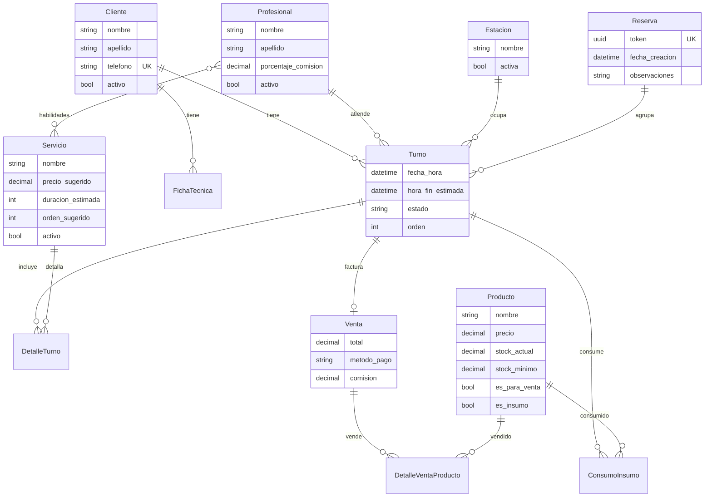

# 💇‍♂️ Studio Salta — Sistema de Gestión Integral para Peluquerías

Plataforma profesional para la gestión de turnos, inventario y administración de salones de belleza.
Diseñado para optimizar la ocupación del salón mediante un motor de agenda continua con búsqueda radial de disponibilidad, autogestión del cliente vía Magic Links, y notificación directa por WhatsApp.

**Producción**: [https://danilo2004.pythonanywhere.com](https://danilo2004.pythonanywhere.com)

---

## 🚀 Inicio Rápido (Desarrollo Local)

```bash
# 1. Clonar el repositorio
git clone https://github.com/PabloDaniloCruz/Peluqueria.git
cd Peluqueria

# 2. Crear y activar entorno virtual
python -m venv env
env\Scripts\activate        # Windows
# source env/bin/activate   # Linux/Mac

# 3. Instalar dependencias
pip install -r requirements.txt

# 4. Configurar base de datos
python manage.py migrate

# 5. Crear usuario administrador
python manage.py createsuperuser

# 6. Ejecutar servidor de desarrollo
python manage.py runserver
```

La aplicación queda disponible en `http://127.0.0.1:8000/`.

---

## 🛠️ Stack Tecnológico

| Capa | Tecnología |
|------|-----------|
| **Backend** | Python 3.10+ · Django 5.2 |
| **Frontend** | Vanilla JavaScript (ES6+) · Bootstrap 5 · Bootstrap Icons · CSS moderno (glassmorphism, gradientes, dark mode) |
| **Base de Datos** | SQLite (desarrollo) · PostgreSQL compatible (producción) |
| **Optimización** | `django-compressor` para minificación y compresión de CSS/JS estáticos |
| **Zona Horaria** | `America/Argentina/Buenos_Aires` con `USE_TZ = True` |
| **Deploy** | PythonAnywhere (cuenta gratuita) |

### Dependencias

```
Django==5.2.1
django_compressor==4.5.1
asgiref==3.8.1
sqlparse==0.5.3
rcssmin==1.1.2
rjsmin==1.2.2
django-appconf==1.0.6
tzdata==2025.1
```

---

## ✨ Características Principales

### 📅 Sistema de Reservas Multi-Servicio

El corazón de la aplicación es un **wizard de reserva de 3 pasos** compartido entre el flujo público (clientes) y el flujo interno (recepción):

| Paso | Descripción |
|------|-------------|
| **1. Datos y Servicios** | El cliente completa sus datos de contacto y selecciona uno o más servicios del catálogo. Se muestra precio y duración estimada en tiempo real. |
| **2. Profesionales** | Para cada servicio, se puede elegir un profesional específico o dejarlo en "Cualquier profesional" para maximizar opciones de horario. |
| **3. Horarios Disponibles** | El motor de disponibilidad calcula las secuencias contiguas válidas y las presenta ordenadas por proximidad al horario preferido. La mejor opción se destaca con ⭐. |

#### Motor de Disponibilidad (`api_disponibilidad.py`)

El algoritmo de disponibilidad implementa:

- **Agenda continua**: Los servicios se encadenan uno tras otro (fin del primero = inicio del segundo), sin huecos.
- **Búsqueda combinatoria**: Genera todas las permutaciones válidas de profesional + estación para cada servicio solicitado.
- **Búsqueda radial**: Si el cliente indica un horario preferido, los resultados se ordenan por proximidad a ese horario (el más cercano es la "Mejor opción").
- **Triple validación de recursos**: Cada slot candidato valida que el profesional, la estación física y el cliente estén libres simultáneamente.
- **Respeto del horario comercial**: Consulta los `HorarioAtencion` configurados y los `CierreExcepcional` para descartar franjas no disponibles.
- **Granularidad de 5 minutos**: Los slots se evalúan en intervalos de 5 minutos para máxima precisión.
- **Alternativas automáticas**: Si se pidió un profesional específico, también genera opciones con otros profesionales habilitados para el mismo servicio.
- **Deduplicación**: Elimina horarios equivalentes duplicados antes de devolver el resultado.
- **Límite de resultados**: Máximo 10 opciones principales + 10 alternativas.

---

### 🔗 Magic Links — Autogestión del Cliente

Cada reserva genera un **token UUID único** (`Reserva.token`) que permite al cliente gestionar sus turnos **sin necesidad de registrarse ni iniciar sesión**:

| Funcionalidad | URL |
|---------------|-----|
| **Ver estado de la reserva** | `/reservas/publica/gestion/<token>/` |
| **Cancelar turnos** | `/reservas/publica/gestion/<token>/cancelar/` |
| **Reprogramar turnos** | Redirige al wizard público con datos pre-cargados |

El enlace de autogestión se incluye automáticamente en:
- El mensaje de WhatsApp que envía la recepción al confirmar.
- La pantalla de confirmación pública.
- El mensaje de cancelación por WhatsApp.

---

### 📱 Integración WhatsApp Click-to-Chat

La integración con WhatsApp se implementa mediante URLs `wa.me` (sin APIs externas ni costos):

| Contexto | Comportamiento |
|----------|---------------|
| **Reserva interna** | Al confirmar, aparece un botón "Enviar Comprobante por WhatsApp" que abre WhatsApp Web/App con el mensaje pre-armado incluyendo servicios, horarios y link de autogestión. |
| **Reserva pública** | La pantalla de confirmación ofrece "Guardar Turno en mi WhatsApp" para que el cliente se envíe el comprobante al chat del salón. |
| **Cancelación desde dashboard** | Modal con dos opciones: "Cancelar sin notificar" o "Cancelar y notificar WhatsApp" que redirige a WhatsApp con mensaje de cancelación + link para reagendar. |
| **Cierres excepcionales** | Al forzar un cierre con turnos afectados, se generan links individuales de WhatsApp para avisar a cada cliente. |
| **Listados** | Los listados de clientes y profesionales incluyen botón de WhatsApp directo. |

El teléfono del salón se configura en `core/settings.py`:
```python
SALON_WHATSAPP = '5493876310898'
```

---

### 📊 Dashboard de Recepción

El dashboard principal ofrece dos modos de visualización:

- **Vista Diaria**: Muestra todos los turnos del día con tarjetas de estado color-coded.
- **Vista Semanal**: Grilla de la semana completa con navegación por semana (`semana_offset`).

#### Filtros Disponibles

| Filtro | Descripción |
|--------|-------------|
| `estado` | pendiente · en_curso · completado · cancelado · por_reprogramar |
| `profesional` | Filtrar por profesional asignado |
| `servicio` | Filtrar por servicio reservado |
| `estacion` | Filtrar por estación física |
| `reserva` | Filtrar por número de reserva |
| `cliente_q` | Búsqueda por nombre/apellido/teléfono del cliente |
| `sin_facturar` | Mostrar solo turnos completados pero sin facturar |

#### Acciones Rápidas por Turno

Cada tarjeta de turno ofrece botones de acción según su estado:
- **Iniciar** (pendiente → en_curso)
- **Facturar** (en_curso → completado + checkout)
- **Cancelar** (con opción de notificar por WhatsApp)
- **Reprogramar** (pre-carga el wizard con los datos del turno)

---

### 💰 Módulo de Facturación y Checkout

Al facturar un turno (`/turno/<id>/facturar/`):

1. Se muestra el **total sugerido** basado en los precios de los servicios (`DetalleTurno.precio_real`).
2. El operador puede ajustar el monto final y elegir el **método de pago** (efectivo, transferencia o tarjeta).
3. Se pueden agregar **productos vendidos** al cliente (descuenta stock automáticamente).
4. Se pueden registrar **insumos consumidos** durante el servicio (descuenta stock automáticamente).
5. Se calcula la **comisión del profesional** según su `porcentaje_comision` (default 40%).
6. Se utiliza **bloqueo pesimista** (`select_for_update`) para evitar doble facturación concurrente.

#### Venta Libre (Mostrador)

La vista `/ventas/nueva/` permite registrar ventas de productos sin asociar a un turno (venta de mostrador).

---

### 📈 Reportes de Facturación

El módulo de reportes (`/reportes/facturacion/`) ofrece:

| KPI | Descripción |
|-----|-------------|
| Ingresos totales | Suma de todas las ventas en el período |
| Comisiones totales | Suma de comisiones generadas |
| Ticket promedio | Promedio por venta |
| Cantidad de turnos facturados | Total de cierres en el período |

**Visualizaciones incluidas:**
- Gráfico de tendencia mensual de ingresos
- Distribución por método de pago (torta)
- Ranking de profesionales por facturación
- Ranking de servicios más solicitados

**Filtros de fecha:** hoy, esta semana, este mes, este año, o rango personalizado.

---

### 👥 Gestión de Clientes

| Funcionalidad | Ruta |
|---------------|------|
| Listado con búsqueda y paginación | `/clientes/` |
| Crear nuevo cliente | `/clientes/nuevo/` |
| Editar cliente | `/clientes/<id>/editar/` |
| Eliminar (soft-delete) | `/clientes/<id>/eliminar/` |
| Reactivar | `/clientes/<id>/reactivar/` |
| Perfil completo | `/clientes/<id>/` |

El **perfil del cliente** incluye:
- Datos de contacto con botón WhatsApp directo
- Historial completo de turnos
- Fichas técnicas asociadas (fórmulas, tipo de cabello, tratamientos)

---

### ✂️ Gestión de Profesionales

| Funcionalidad | Ruta |
|---------------|------|
| Listado con pestañas activos/inactivos | `/profesionales/` |
| Crear nuevo profesional | `/profesionales/nuevo/` |
| Editar (incluye habilidades y comisión) | `/profesionales/<id>/editar/` |
| Eliminar (soft-delete) | `/profesionales/<id>/eliminar/` |
| Reactivar | `/profesionales/<id>/reactivar/` |

Cada profesional tiene:
- **Habilidades** (M2M con Servicio): Define qué servicios puede realizar.
- **Porcentaje de comisión**: Se aplica automáticamente al facturar (default 40%).

---

### 🛎️ Gestión de Servicios

| Funcionalidad | Ruta |
|---------------|------|
| Listado reordenable (drag & drop) | `/servicios/` |
| Crear nuevo servicio | `/servicios/nuevo/` |
| Editar servicio | `/servicios/<id>/editar/` |
| Eliminar (soft-delete) | `/servicios/<id>/eliminar/` |
| Reactivar | `/servicios/<id>/reactivar/` |
| Reordenar (AJAX) | `/servicios/reordenar/` |

Cada servicio define: nombre, descripción, precio sugerido, duración estimada (en minutos) y orden de visualización.

---

### 💺 Gestión de Estaciones Físicas

Las estaciones representan los puestos físicos del salón (sillas, lava-cabezas, etc.). El motor de disponibilidad las utiliza para evitar la **colisión de espacio**: dos turnos simultáneos no pueden usar la misma estación.

| Funcionalidad | Ruta |
|---------------|------|
| Listado | `/estaciones/` |
| Crear/Editar | `/estaciones/nueva/` · `/estaciones/<id>/editar/` |
| Eliminar (soft-delete) | `/estaciones/<id>/eliminar/` |
| Reactivar | `/estaciones/<id>/reactivar/` |

---

### 📦 Inventario y Productos

El sistema de inventario maneja dos tipos de productos con un único modelo:

| Tipo | Flag | Uso |
|------|------|-----|
| **Producto para venta** | `es_para_venta = True` | Productos retail vendidos al cliente en el checkout o en venta libre. |
| **Insumo** | `es_insumo = True` | Materiales consumidos durante el servicio (tinturas, shampoo, etc.). Se registran en el checkout. |

Un producto puede ser ambos simultáneamente.

#### Funcionalidades de Inventario

| Funcionalidad | Ruta |
|---------------|------|
| Listado con alertas de stock bajo | `/productos/` |
| Crear/Editar producto | `/productos/nuevo/` · `/productos/<id>/editar/` |
| Eliminar (soft-delete) | `/productos/<id>/eliminar/` |
| Reactivar | `/productos/<id>/reactivar/` |
| Ajuste rápido de stock (+/-) | `/productos/<id>/stock/<accion>/` |
| Ajuste masivo de precios (%) | `/productos/ajuste_masivo/` |

**Alerta de stock bajo**: Se muestra cuando `stock_actual <= stock_minimo`.

---

### ⚙️ Configuración del Salón

#### Horarios de Atención (`HorarioAtencion`)

Configuración de horarios por día de la semana (Lunes=0 a Domingo=6). Soporta **múltiples turnos por día** (ej: mañana y tarde).

| Funcionalidad | Ruta |
|---------------|------|
| Panel de configuración | `/configuracion/` |
| Crear/Editar horario | `/configuracion/horarios/nuevo/` · `/configuracion/horarios/<id>/editar/` |
| Eliminar horario | `/configuracion/horarios/<id>/eliminar/` |

#### Cierres Excepcionales (`CierreExcepcional`)

Permite registrar feriados o cierres no programados (día completo o rango horario parcial).

| Funcionalidad | Ruta |
|---------------|------|
| Crear/Editar cierre | `/configuracion/cierres/nuevo/` · `/configuracion/cierres/<id>/editar/` |
| Eliminar cierre | `/configuracion/cierres/<id>/eliminar/` |

**Flujo de cierre con conflictos:**
1. Al registrar un cierre en una fecha con turnos pendientes, el sistema **detecta automáticamente los turnos afectados**.
2. Muestra la lista de clientes afectados con botones individuales de WhatsApp para avisar.
3. El operador puede **forzar el cierre**, lo que pasa todos los turnos afectados a estado `por_reprogramar`.

---

### 📋 Fichas Técnicas

Registro profesional de tratamientos capilares asociados a un turno:

- Tipo de cabello
- Color base
- Fórmula utilizada
- Tratamientos previos
- Notas generales

Accesibles desde el perfil del cliente y desde el turno correspondiente.

---

## 🔒 Patrones Arquitectónicos

| Patrón | Implementación |
|--------|---------------|
| **Soft Deletes** | Todas las entidades principales usan `activo = BooleanField(default=True)` en lugar de borrado físico. |
| **Bloqueo Pesimista** | `select_for_update()` sobre Turno, Cliente, Profesional y Estación durante la creación de reservas para prevenir condiciones de carrera. |
| **Transacciones Atómicas** | Todo flujo de reserva y facturación envuelto en `transaction.atomic()`. |
| **Magic Links (UUID)** | `Reserva.token` (UUID4 auto-generado) habilita autogestión sin autenticación. |
| **Control de Saturación** | Máximo 2 turnos futuros activos por teléfono (solo en flujo público). Validación en dos capas: al buscar disponibilidad y al confirmar. |
| **Localización de Zona Horaria** | `timezone.localtime()` en todas las vistas que generan texto orientado al cliente (mensajes de WhatsApp, confirmaciones). |
| **Inventario Dual** | Un único modelo `Producto` con flags `es_para_venta` / `es_insumo` cubre productos retail e insumos profesionales. |
| **Comisiones Dinámicas** | Porcentaje configurable por profesional, aplicado automáticamente en el checkout. |

---

## 📁 Estructura del Proyecto

```
studio-salta/
├── core/                          # Configuración Django
│   ├── settings.py                # Settings (TZ, SALON_WHATSAPP, compressor, etc.)
│   ├── urls.py                    # URL raíz (incluye gestion.urls)
│   └── wsgi.py                    # Entry point WSGI (PythonAnywhere)
│
├── gestion/                       # App principal
│   ├── models/                    # Modelos de datos
│   │   ├── clientes.py            # Cliente
│   │   ├── configuracion.py       # HorarioAtencion, CierreExcepcional
│   │   ├── estaciones.py          # Estacion (puestos físicos)
│   │   ├── fichas.py              # FichaTecnica
│   │   ├── productos.py           # Producto (venta + insumo)
│   │   ├── profesionales.py       # Profesional (con habilidades y comisión)
│   │   ├── servicios.py           # Servicio (catálogo)
│   │   ├── turnos.py              # Turno, Reserva, DetalleTurno
│   │   └── ventas.py              # Venta, DetalleVentaProducto, ConsumoInsumo
│   │
│   ├── views/                     # Vistas organizadas por dominio
│   │   ├── api.py                 # APIs legacy (horarios, búsqueda clientes)
│   │   ├── clientes.py            # CRUD clientes + perfil
│   │   ├── configuracion.py       # Horarios + cierres excepcionales
│   │   ├── dashboard.py           # Dashboard recepción (diario/semanal)
│   │   ├── estaciones.py          # CRUD estaciones
│   │   ├── fichas.py              # Fichas técnicas
│   │   ├── productos.py           # CRUD inventario + ajuste masivo
│   │   ├── profesionales.py       # CRUD profesionales
│   │   ├── reportes.py            # Reportes de facturación + KPIs
│   │   ├── reservas.py            # Wizard de reservas (público + interno)
│   │   ├── servicios.py           # CRUD servicios + reordenamiento
│   │   ├── turnos.py              # Acciones sobre turnos (cancelar, iniciar, facturar)
│   │   └── ventas.py              # Venta libre (mostrador)
│   │
│   ├── api_disponibilidad.py      # Motor de disponibilidad multi-servicio
│   ├── forms.py                   # Formularios Django
│   ├── urls.py                    # Rutas de la app
│   ├── templatetags/
│   │   └── gestion_extras.py      # Filtro wa_phone (limpieza teléfono → WhatsApp)
│   │
│   └── static/gestion/
│       ├── css/
│       │   ├── wizard.css          # Estilos del wizard de reservas
│       │   └── dashboard.css       # Estilos del dashboard
│       └── js/
│           └── wizard_reserva.js   # Lógica compartida del wizard (público + interno)
│
├── templates/
│   ├── base.html                  # Layout base (Bootstrap 5 + navbar + sidebar)
│   └── gestion/
│       ├── dashboard.html          # Dashboard principal
│       ├── reserva_publica_wizard.html  # Wizard público (3 pasos)
│       ├── reserva_interna.html    # Wizard interno (3 pasos + buscador clientes)
│       ├── confirmacion_publica.html    # Confirmación con WhatsApp + Calendar
│       ├── gestion_publica.html    # Portal autogestión (Magic Link)
│       ├── cancelar_publica.html   # Cancelación desde autogestión
│       ├── facturar.html           # Checkout / facturación
│       ├── partials/
│       │   └── _modal_cancelacion.html  # Modal cancelar + notificar WhatsApp
│       ├── configuracion/
│       │   ├── panel.html          # Panel horarios + cierres
│       │   ├── horario_form.html   # Form de horario
│       │   └── cierre_form.html    # Form de cierre con afectados
│       └── reportes/
│           └── facturacion.html    # Dashboard de reportes
│
├── docs/
│   └── DEPLOY_PRODUCCION.md       # Guía paso a paso para deploy en PythonAnywhere
│
├── requirements.txt
└── manage.py
```

---

## 🧪 Tests

El proyecto incluye **11 tests unitarios** que cubren:

| Área | Tests |
|------|-------|
| Generación de slots dentro del horario comercial | ✅ |
| Filtrado de horarios pasados (para el día actual) | ✅ |
| Disponibilidad del profesional (slots ocupados) | ✅ |
| Disponibilidad de estaciones (colisión de espacio) | ✅ |
| Validación de habilidades (profesional ↔ servicio) | ✅ |
| Manejo de días cerrados | ✅ |
| Múltiples turnos por día | ✅ |
| Prevención de doble-booking del cliente | ✅ |
| Casos borde (horarios límite, multi-estación) | ✅ |
| Vista del dashboard (HTTP 200) | ✅ |

```bash
# Ejecutar tests
python manage.py test
```

---

## 🌐 Deploy a Producción (PythonAnywhere)

La documentación completa de deploy se encuentra en [`docs/DEPLOY_PRODUCCION.md`](docs/DEPLOY_PRODUCCION.md).

### Resumen del flujo de actualización:

```bash
# En la consola de PythonAnywhere (con venv activado)
cd ~/Peluqueria
git pull origin main
python manage.py collectstatic --no-input
python manage.py migrate
# → Ir a Web tab → Reload
```

### Variables de entorno requeridas en producción:

| Variable | Valor |
|----------|-------|
| `DJANGO_SECRET_KEY` | Clave secreta única generada |
| `DJANGO_DEBUG` | `False` |
| `DJANGO_ALLOWED_HOSTS` | `danilo2004.pythonanywhere.com` |

---

## 📐 Modelo de Datos



---

© 2026 Studio Salta — Gestión Profesional de Peluquería.
