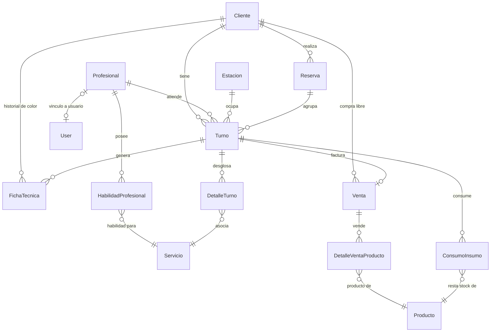

# Informe Técnico: Diagrama Entidad-Relación (DER) — Studio Salta

Este documento proporciona una descripción exhaustiva y detallada del modelo de datos y el **Diagrama Entidad-Relación (DER)** de la base de datos de **Studio Salta**. El sistema está diseñado en módulos desacoplados y altamente cohesivos bajo el framework Django, permitiendo una escalabilidad sólida y garantizando la integridad referencial y de negocio.

---

## 1. Diagrama Entidad-Relación (Mermaid)

El siguiente diagrama visualiza de manera clara y precisa el flujo relacional de la base de datos, incluyendo cardinalidades y vínculos de claves foráneas.

---

## 2. Descripción Detallada de las Tablas por Módulo

El modelo de datos se estructura en 5 sub-módulos conceptuales que dividen las responsabilidades de la peluquería:

### A. Módulo de Clientes & Fichas
Encargado de registrar los datos personales de los clientes y el historial clínico de tratamientos de coloración.

#### 1. Tabla: `Cliente` (`gestion_cliente`)
Almacena el perfil de los clientes recurrentes del salón.
*   `id` (BigAutoKey, PK): Identificador único autoincremental.
*   `nombre` (CharField, max_length=100): Nombre del cliente.
*   `apellido` (CharField, max_length=100): Apellido del cliente.
*   `telefono` (CharField, max_length=20, blank=True): Teléfono de contacto (utilizado para controlar la saturación de reservas).
*   `email` (EmailField, blank=True): Correo electrónico.
*   `fecha_registro` (DateTimeField, auto_now_add=True): Fecha y hora en que se registró.
*   `activo` (BooleanField, default=True): Estado de habilitación del cliente en el sistema.

#### 2. Tabla: `FichaTecnica` (`gestion_fichatecnica`)
Almacena el historial técnico de fórmulas químicas para tratamientos complejos de peluquería (tintura, alisados, etc.).
*   `id` (BigAutoKey, PK): Identificador único.
*   `cliente_id` (ForeignKey a `Cliente`, CASCADE): Cliente al que pertenece la ficha.
*   `turno_id` (ForeignKey a `Turno`, SET_NULL, null=True, blank=True): Turno específico donde se generó o aplicó esta fórmula.
*   `fecha_creacion` (DateTimeField, auto_now_add=True): Registro temporal de creación de la ficha.
*   `descripcion` (TextField, blank=True, null=True): Resumen o nombre del tratamiento.
*   `formula_quimica` (TextField, blank=True, null=True): Detalle técnico (ej. *"60g Tintura 7.1 + 60ml Oxidante 20 Vol"*).
*   `observaciones` (TextField, blank=True): Anotaciones sobre comportamiento del cabello o tiempos de acción.

---

### B. Módulo de Profesionales & Habilidades
Define el perfil de los estilistas, sus comisiones pactadas y qué servicios están capacitados para realizar.

#### 3. Tabla: `Profesional` (`gestion_profesional`)
Representa a los peluqueros y especialistas del salón.
*   `id` (BigAutoKey, PK): Identificador único.
*   `nombre` (CharField, max_length=100): Nombre.
*   `apellido` (CharField, max_length=100): Apellido.
*   `telefono` (CharField, max_length=20, blank=True): Teléfono.
*   `email` (EmailField, blank=True): Correo electrónico de contacto.
*   `porcentaje_comision` (IntegerField, default=35): Comisión pactada sobre los servicios completados (rango de 0 a 100).
*   `activo` (BooleanField, default=True): Permite deshabilitar a un profesional sin romper su historial de turnos o ventas.
*   `fecha_contratacion` (DateField, auto_now_add=True): Fecha de ingreso.
*   `usuario_id` (OneToOneField a `auth_user`, SET_NULL, null=True, blank=True): Vinculación opcional con las credenciales del sistema para acceso administrativo.

#### 4. Tabla: `HabilidadProfesional` (`gestion_habilidadprofesional`)
Tabla intermedia que define la relación muchos-a-muchos (`M:N`) entre `Profesional` y `Servicio`.
*   `id` (BigAutoKey, PK): Identificador único.
*   `profesional_id` (ForeignKey a `Profesional`, CASCADE): Estilista asociado.
*   `servicio_id` (ForeignKey a `Servicio`, CASCADE): Servicio habilitado para ese estilista.
*   *Restricción (UniqueConstraint):* `uq_habilidad_profesional` sobre `(profesional_id, servicio_id)` para evitar duplicidad de habilidades.

---

### C. Módulo de Servicios & Recursos Físicos
Representa el catálogo de servicios, la infraestructura física (estaciones) y los límites temporales de atención.

#### 5. Tabla: `Servicio` (`gestion_servicio`)
El catálogo de tratamientos ofrecidos por el salón.
*   `id` (BigAutoKey, PK): Identificador único.
*   `nombre` (CharField, max_length=100, unique=True): Nombre único comercial.
*   `descripcion` (TextField, blank=True): Explicación del servicio.
*   `precio_sugerido` (DecimalField, max_digits=10, decimal_places=2, >=0): Tarifa base sugerida.
*   `duracion_estimada` (PositiveIntegerField): Duración del servicio expresada en minutos.
*   `orden_sugerido` (PositiveSmallIntegerField, default=0): Posición para el cálculo inteligente de secuencias multi-servicio (el orden define qué servicio debe realizarse primero).
*   `activo` (BooleanField, default=True): Estado de vigencia del servicio.

#### 6. Tabla: `Estacion` (`gestion_estacion`)
Representa los recursos físicos del salón (sillón de corte, lava-cabezas), fundamentales para la asignación de capacidad operativa.
*   `id` (BigAutoKey, PK): Identificador único.
*   `nombre` (CharField, max_length=50, unique=True): Nombre de la estación (ej. *"Estación Corte 1"*, *"Lavacabezas B"*).
*   `tipo` (CharField, max_length=20): Tipo de recurso (`estacion` o `lavacabeza`).
*   `activa` (BooleanField, default=True): Habilitación física de la estación.

#### 7. Tabla: `HorarioAtencion` (`gestion_horarioatencion`)
Define la matriz semanal de horarios del salón para validar reservas válidas.
*   `id` (BigAutoKey, PK): Identificador único.
*   `dia_semana` (IntegerField): Día de la semana (0 = Lunes a 6 = Domingo).
*   `hora_apertura` (TimeField): Hora límite de apertura comercial.
*   `hora_cierre` (TimeField): Hora límite de cierre comercial.
*   `abierto` (BooleanField, default=True): Define si el local opera ese día específico.

#### 8. Tabla: `CierreExcepcional` (`gestion_cierreexcepcional`)
Registra días festivos, vacaciones o suspensiones excepcionales del servicio para bloquear reservas.
*   `id` (BigAutoKey, PK): Identificador único.
*   `fecha` (DateField): Día del cierre.
*   `descripcion` (CharField, max_length=200, blank=True): Motivo del cierre.
*   `es_dia_completo` (BooleanField, default=True): Bloqueo total de la fecha.
*   `hora_inicio` (TimeField, null=True, blank=True): Inicio de bloqueo parcial.
*   `hora_fin` (TimeField, null=True, blank=True): Fin de bloqueo parcial.

---

### D. Módulo de Turnos & Agendamiento
Es el núcleo transaccional del sistema, encargado de la agenda, la prevención de solapamientos y la gestión secuencial de servicios.

#### 9. Tabla: `Reserva` (`gestion_reserva`)
Agrupa múltiples turnos individuales agendados de forma contigua en una misma sesión transaccional (ej. una cliente reserva un corte y luego una tintura en secuencia).
*   `id` (BigAutoKey, PK): Identificador único.
*   `cliente_id` (ForeignKey a `Cliente`, CASCADE): Cliente que realizó el agendamiento.
*   `fecha_creacion` (DateTimeField, auto_now_add=True): Fecha de solicitud.
*   `observaciones` (TextField, blank=True): Comentarios globales de la reserva.

#### 10. Tabla: `Turno` (`gestion_turno`)
Representa la asignación concreta de una franja horaria para un cliente con un profesional en una estación física.
*   `id` (BigAutoKey, PK): Identificador único.
*   `cliente_id` (ForeignKey a `Cliente`, CASCADE): Cliente agendado.
*   `profesional_id` (ForeignKey a `Profesional`, CASCADE): Estilista asignado.
*   `estacion_id` (ForeignKey a `Estacion`, CASCADE): Recurso físico asignado.
*   `fecha_hora` (DateTimeField): Inicio del turno.
*   `hora_fin_estimada` (DateTimeField, null=True, blank=True): Fin del turno calculado en base a la sumatoria de duración de los servicios.
*   `estado` (CharField, max_length=20, default='pendiente'): Ciclo de vida (`pendiente`, `en_curso`, `completado`, `cancelado`, `por_reprogramar`).
*   `observaciones` (TextField, blank=True): Comentarios específicos.
*   `fecha_creacion` (DateTimeField, auto_now_add=True): Registro de inserción.
*   `reserva_id` (ForeignKey a `Reserva`, SET_NULL, null=True, blank=True): Vínculo grupal de la sesión de reserva.
*   `orden` (PositiveSmallIntegerField, default=0): Secuencia interna del turno dentro del grupo de reserva.

#### 11. Tabla: `DetalleTurno` (`gestion_detalleturno`)
Tabla intermedia de la relación `M:N` entre `Turno` y `Servicio`.
*   `id` (BigAutoKey, PK): Identificador único.
*   `turno_id` (ForeignKey a `Turno`, CASCADE): Turno de origen.
*   `servicio_id` (ForeignKey a `Servicio`, CASCADE): Servicio prestado.
*   `precio_real` (DecimalField, max_digits=10, decimal_places=2, >=0): Precio efectivamente cobrado al cliente. Esto es fundamental para registrar descuentos manuales o promociones de forma histórica sin alterar el catálogo maestro.
*   *Restricción (UniqueConstraint):* `uq_detalle_turno` sobre `(turno_id, servicio_id)` para asegurar que no se duplique un mismo tipo de servicio en un único bloque de turno.

---

### E. Módulo de Facturación, Ventas & Stock
Administra el inventario de insumos/productos y los cierres de caja (ventas directas o asociadas a un turno).

#### 12. Tabla: `Producto` (`gestion_producto`)
Maestro de artículos del salón para uso interno (insumos de tintura) o reventa.
*   `id` (BigAutoKey, PK): Identificador único.
*   `nombre` (CharField, max_length=100, unique=True): Nombre del producto.
*   `descripcion` (TextField, blank=True): Detalle técnico.
*   `es_para_venta` (BooleanField, default=True): Determina si el artículo se puede facturar al público.
*   `es_insumo` (BooleanField, default=False): Indica si se consume internamente en los servicios.
*   `unidad_medida` (CharField, max_length=20, default='unidades'): Presentación (`unidades`, `gramos`, `mililitros`).
*   `precio` (DecimalField, max_digits=10, decimal_places=2, null=True, blank=True): Precio de venta.
*   `stock_actual` (DecimalField, max_digits=10, decimal_places=2, default=0): Stock remanente en tiempo real.
*   `stock_minimo` (DecimalField, max_digits=10, decimal_places=2, default=0): Punto de reorden para disparar alertas de stock crítico.
*   `activo` (BooleanField, default=True): Vigencia comercial.

#### 13. Tabla: `ConsumoInsumo` (`gestion_consumoinsumo`)
Registra las cantidades específicas de insumos gastadas en la realización de un servicio durante un turno.
*   `id` (BigAutoKey, PK): Identificador único.
*   `turno_id` (ForeignKey a `Turno`, CASCADE): Turno en el que ocurrió el consumo.
*   `producto_id` (ForeignKey a `Producto`, RESTRICT): Insumo consumido.
*   `cantidad_usada` (DecimalField, max_digits=10, decimal_places=2, >=0.01): Cantidad del producto (ej. 45.50 gramos).
*   *Protección referencial:* `ON_DELETE=RESTRICT` para evitar borrar productos que tengan consumos históricos documentados.

#### 14. Tabla: `Venta` (`gestion_venta`)
Factura final. Representa tanto el cobro de un turno completado como ventas libres en mostrador.
*   `id` (BigAutoKey, PK): Identificador único.
*   `turno_id` (OneToOneField a `Turno`, CASCADE, null=True, blank=True): Vínculo 1:1 único con el turno facturado (si aplica).
*   `cliente_id` (ForeignKey a `Cliente`, SET_NULL, null=True, blank=True): Cliente que compra (obligatorio si es turno, opcional si es venta directa en mostrador).
*   `total` (DecimalField, max_digits=10, decimal_places=2): Monto bruto de la transacción.
*   `metodo_pago` (CharField, max_length=20): Medio de pago (`efectivo`, `tarjeta_debito`, `tarjeta_credito`, `transferencia`, `mercadopago`).
*   `comision` (DecimalField, max_digits=10, decimal_places=2): Comisión congelada para el estilista, calculada en el momento exacto del cobro basándose en el porcentaje del profesional (`total * (profesional.porcentaje_comision / 100)`). Esto protege el historial ante eventuales cambios futuros en las comisiones de perfil.
*   `fecha_venta` (DateTimeField, auto_now_add=True): Registro cronológico de la operación.

#### 15. Tabla: `DetalleVentaProducto` (`gestion_detalleventaproducto`)
Detalle de artículos físicos agregados a una factura de venta.
*   `id` (BigAutoKey, PK): Identificador único.
*   `venta_id` (ForeignKey a `Venta`, CASCADE): Venta a la que se anexa.
*   `producto_id` (ForeignKey a `Producto`, RESTRICT): Producto físico vendido.
*   `cantidad` (PositiveIntegerField, default=1): Cantidad de ítems.
*   `precio_unitario` (DecimalField, max_digits=10, decimal_places=2): Precio de venta capturado en el momento de la transacción.

---

## 3. Reglas de Negocio Implementadas a Nivel de Base de Datos

El diseño relacional y las restricciones de Django del sistema no son meramente descriptivos, sino que ejecutan de forma estricta las siguientes políticas operativas:

1.  **Prevención Atómica de Condiciones de Carrera (Concurrencia)**:
    En las reservas públicas y la facturación, los profesionales y las estaciones son tratados como recursos críticos. Las transacciones usan `select_for_update` ordenando consistentemente sus IDs numéricos de menor a mayor para evitar interbloqueos (*deadlocks*).
2.  **Validación de Triple Coincidencia**:
    Un `Turno` no se puede crear si colisiona en el mismo rango de fecha y hora con un registro existente para el mismo **Cliente**, el mismo **Profesional** o la misma **Estación**.
3.  **Límite de Saturación de Clientes**:
    Para evitar el spam de turnos mediante el asistente público, el sistema restringe el agendamiento a un máximo de **2 turnos pendientes a futuro** por número de teléfono.
4.  **Congelación de Precios e Historial de Comisiones**:
    Tanto `DetalleTurno.precio_real` como `Venta.comision` guardan los valores finales numéricos. Esto evita recalculaciones erróneas si la peluquería decide ajustar el precio sugerido de un servicio en el catálogo o renegociar el porcentaje de comisión con un estilista en el futuro.
5.  **Restricciones de Borrado en Cascada Segura**:
    *   Si se borra un `Cliente`, se eliminan sus turnos (`CASCADE`), pero si se borra una `Venta` o un `Turno`, los consumos o productos asociados están protegidos por `RESTRICT` para no alterar el inventario ni la contabilidad.
    *   La relación `FichaTecnica` e `User` con `Turno` y `Profesional` respectivamente utiliza `SET_NULL`, impidiendo pérdidas masivas de datos históricos si se elimina temporalmente una entidad relacionada.
