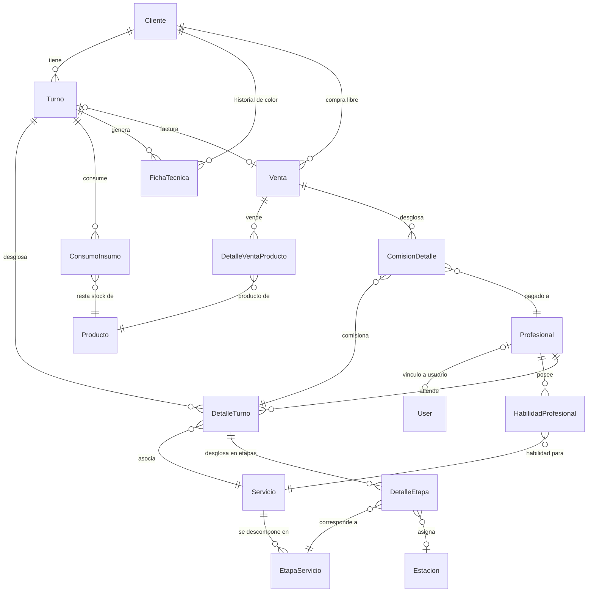

# Informe Técnico: Diagrama Entidad-Relación (DER) — Studio Salta

Este documento describe el modelo de datos y el **Diagrama Entidad-Relación (DER)** de **Studio Salta**, explicando **no solo qué almacena cada atributo, sino por qué existe**: qué problema resuelve, qué decisión de negocio refleja, o qué restricción impone.

---

## 1. Diagrama Entidad-Relación (Mermaid)

---

## 2. Descripción Detallada de las Tablas por Módulo

El modelo de datos se estructura en 5 submódulos (**17 tablas**):

---

### A. Módulo de Clientes & Fichas

#### 1. Tabla: `Cliente` (`gestion_cliente`)

**Por qué existe:** Todo turno necesita un sujeto. Separar `Cliente` de `Turno` permite que un mismo cliente tenga múltiples visitas, historial, y fichas técnicas sin duplicar datos personales.

| Atributo | Razón |
|----------|-------|
| `id` (PK) | Identificador interno. Nunca se expone al cliente; se usa solo para relaciones entre tablas. |
| `dni` (unique, nullable) | **Por qué nullable:** No todos los clientes tienen DNI (extranjeros, turistas). **Por qué unique:** Evita que un mismo cliente se registre dos veces. |
| `nombre`, `apellido` | Datos mínimos para identificar a la persona. No se separan en un modelo "Persona" porque no hay herencia compleja: alcanza con estos dos campos. |
| `telefono` | **El campo más crítico para negocio.** Se usa para: (1) contactar al cliente, (2) limitar a 2 turnos futuros por teléfono (anti-spam), (3) enviar recordatorios por WhatsApp. |
| `email` (opcional) | Secundario. Sirve para confirmación digital, pero la peluquería opera principalmente por teléfono. |
| `fecha_registro` (auto_now_add) | Auditoría: saber cuándo entró cada cliente al sistema. |
| `activo` (default=True) | **Por qué no se borran clientes:** Borrar un cliente rompería el histórico de turnos, fichas y ventas. Mejor deshabilitar. |

---

#### 2. Tabla: `FichaTecnica` (`gestion_fichatecnica`)

**Por qué existe:** Los tratamientos de coloración requieren registrar fórmulas químicas exactas para repetirlas en visitas futuras. No es un simple comentario — es información estructurada que un profesional necesita consultar rápido.

| Atributo | Razón |
|----------|-------|
| `cliente_id` (FK → Cliente) | La ficha pertenece al cliente, no al turno. Un cliente puede tener muchas fichas a lo largo del tiempo. |
| `turno_id` (FK → Turno, nullable) | **Por qué nullable:** Una ficha puede cargarse fuera de un turno (ej. el cliente vino solo a consultar). **SET_NULL** al borrar el turno para no perder la fórmula histórica. |
| `fecha_creacion` (auto_now_add) | Las fórmulas cambian con el tiempo (ej. mismo cliente, diferente marca de tinte). La fecha permite saber cuál es la más reciente. |
| `descripcion` | Nombre del tratamiento (ej. "Retoque de raíces Tono 7.1") para identificarlo rápido sin leer la fórmula completa. |
| `formula_quimica` | **El corazón del modelo.** Texto libre con la receta exacta (ej. "60g Tinte 7.1 + 60ml Oxidante 20V"). No se estructura porque cada marca y tratamiento tiene combinaciones impredecibles. |
| `observaciones` | Info que no encaja en fórmula: "el cabello agarró más rojo de lo esperado", "dejar 5min extra". |

---

### B. Módulo de Profesionales & Habilidades

#### 3. Tabla: `Profesional` (`gestion_profesional`)

**Por qué existe:** Los profesionales son un recurso distinto a los usuarios del sistema. Un empleado puede no tener acceso al sistema (ej. pasante), y un usuario administrador puede no ser profesional.

| Atributo | Razón |
|----------|-------|
| `dni` (unique, nullable) | Misma lógica que Cliente: identificación fiscal, opcional. |
| `nombre`, `apellido` | Identificación básica. |
| `telefono`, `email` | Contacto directo del empleado. |
| `porcentaje_comision` (default=35) | **Por qué está en Profesional y no es fijo:** Cada profesional negocia su comisión individualmente (ej. uno con más experiencia cobra 40%, otro 30%). Se congela en `ComisionDetalle.monto` al facturar para que cambios futuros no alteren el histórico. |
| `activo` (default=True) | Deshabilitar sin perder histórico de turnos, comisiones ni ventas. |
| `fecha_contratacion` (auto_now_add) | Control administrativo: antigüedad, liquidación, etc. |
| `usuario_id` (1:1 → auth.User, nullable) | **Por qué nullable:** Un profesional puede no tener acceso al sistema. **SET_NULL** al borrar el usuario para no perder el profesional. |

---

#### 4. Tabla: `HabilidadProfesional` (`gestion_habilidadprofesional`)

**Por qué existe:** Relación M:N entre Profesional y Servicio. No todos saben hacer todo (ej. un barbero no necesariamente hace alisado japonés). Sin esta tabla, cualquier profesional podría recibir turnos para cualquier servicio.

| Atributo | Razón |
|----------|-------|
| `profesional_id` (FK → Profesional) | A quién se habilita. |
| `servicio_id` (FK → Servicio) | Qué servicio puede realizar. |
| *UniqueConstraint(profesional, servicio)* | **Por qué:** Evita que se registre la misma habilidad dos veces por error. |

---

### C. Módulo de Servicios & Recursos Físicos

#### 5. Tabla: `Servicio` (`gestion_servicio`)

**Por qué existe:** Catálogo de lo que el salón ofrece. Separado de Turno porque un servicio se presta muchas veces, y separado de sus etapas (EtapaServicio) para permitir cálculos de scheduling sin tocar la definición del servicio.

| Atributo | Razón |
|----------|-------|
| `nombre` (unique) | Identificador comercial. Único para no confundir servicios en la UI. |
| `descripcion` | Opcional. Ayuda al cliente a entender qué incluye. |
| `precio_sugerido` (>=0) | **Sugerido**, no fijo. El precio real se guarda en `DetalleTurno.precio_real` para permitir descuentos sin alterar el catálogo. |
| `duracion_estimada` (**@property**) | **Por qué no es un campo:** Se calcula sumando la duración de las EtapaServicio. Si se cambiara una etapa, la duración se actualiza automáticamente. No hay riesgo de desincronización. |
| `orden_sugerido` (default=0) | **Por qué existe:** Cuando un cliente pide múltiples servicios (ej. Corte + Baño de Crema), este campo define qué orden tiene más sentido (lavar primero, cortar después). |
| `activo` (default=True) | Ocultar servicios descontinuados sin borrar referencias históricas. |

---

#### 6. Tabla: `EtapaServicio` (`gestion_etapaservicio`)

**Por qué existe (la explicación clave):** No todos los servicios son un bloque monolítico. Un "Corte + Lavado + Peinado" tiene pasos que requieren **distintos recursos** en distintos momentos: el lavado necesita un lavacabezas, el corte una silla, y el peinado puede necesitar la silla de nuevo. Cada etapa tiene duración, tipo de estación, y dependencia del profesional diferentes.

`EtapaServicio` es la **definición/plantilla** del servicio. Se crea una vez cuando se da de alta un servicio en el catálogo. No tiene clientes, ni fechas, ni asignaciones concretas.

| Atributo | Razón |
|----------|-------|
| `servicio_id` (FK → Servicio) | A qué servicio pertenece esta etapa. **CASCADE** porque si el servicio se elimina, sus etapas no tienen sentido. |
| `orden` (PositiveIntegerField) | La secuencia importa. No es lo mismo lavar antes de cortar que al revés. |
| `nombre` (CharField) | Etiqueta humana: "Aplicación", "Exposición", "Lavado", "Corte". |
| `duracion` (PositiveIntegerField) | **Múltiplo de 5:** El motor de scheduling trabaja con slots de 5 minutos. Si una etapa dura 17 minutos, ese slot quedaría inutilizable. Esta regla evita desperdicio de capacidad. |
| `tipo_estacion` (choices) | **Define qué recurso físico necesita:** `estacion` (silla), `lavacabeza`, o `ninguna` (ej. tiempo de espera sin ocupar un recurso). |
| `requiere_profesional` (default=True) | **Por qué este campo es clave para la eficiencia:** Durante la exposición de una tintura (20min), el profesional no necesita estar presente. Este flag permite que el algoritmo libere al profesional para atender a otro cliente en ese intervalo, en lugar de bloquearlo. |
| *UniqueConstraint(servicio, orden)* | No puede haber dos "paso 1" en el mismo servicio. |

**🧠 Pensalo así:** `Servicio` es "Corte + Lavado" (lo que está en el menú). `EtapaServicio` es la **receta**: paso 1 — Lavado (15min, lavacabezas, requiere profe), paso 2 — Corte (20min, silla, requiere profe). Es **conceptual**, no tiene fecha ni cliente.

---

#### 7. Tabla: `Estacion` (`gestion_estacion`)

**Por qué existe:** Las estaciones son recursos físicos finitos (3 sillas, 2 lavacabezas). El algoritmo de disponibilidad necesita saber cuántas hay de cada tipo para no sobre-asignar.

| Atributo | Razón |
|----------|-------|
| `nombre` (unique) | "Silla 1", "Lavacabezas A" — identificable en el mapa del salón. |
| `tipo` (choices: estacion / lavacabeza) | **Por qué separar por tipo:** El algoritmo busca estaciones libres del tipo que la `EtapaServicio` necesita. Si una etapa requiere lavacabezas, no sirve asignarle una silla de corte. |
| `activa` (default=True) | Una estación puede estar fuera de servicio (rotura, refacción) sin borrar su historial. |

---

#### 8. Tabla: `HorarioAtencion` (`gestion_horarioatencion`)

**Por qué existe:** Define cuándo el salón está abierto. Sin esto, cualquier horario sería válido.

| Atributo | Razón |
|----------|-------|
| `dia_semana` (0-6) | Lunes a domingo. No se usan fechas porque el horario es semanal, no calendario. |
| `hora_apertura`, `hora_cierre` | Rango de operación. **No se guarda duración:** cada día puede tener distinto horario (ej. sábados medio día). |
| `abierto` (default=True) | Días de descanso semanal sin borrar el registro. |

---

#### 9. Tabla: `CierreExcepcional` (`gestion_cierreexcepcional`)

**Por qué existe:** Feriados, vacaciones, mantenimiento. No se pueden modelar como `HorarioAtencion` porque son fechas puntuales, no semanales.

| Atributo | Razón |
|----------|-------|
| `fecha` | El día específico del cierre. |
| `descripcion` | Por qué se cierra (auditoría, y para mostrárselo al cliente al intentar reservar). |
| `es_dia_completo` (default=True) | Permite bloqueos totales (feriado) o parciales (capacitación de 14 a 16). |
| `hora_inicio`, `hora_fin` | Solo relevantes si `es_dia_completo=False`. Definen la ventana bloqueada. |

---

### D. Módulo de Turnos & Agendamiento (el núcleo del sistema)

#### 10. Tabla: `Turno` (`gestion_turno`)

**Por qué existe:** Representa una visita de un cliente al salón. Es la entidad raíz del agendamiento. Los recursos (profesional, estación) **ya no se asignan directamente sobre Turno** — se delegan a `DetalleTurno` y `DetalleEtapa` para soportar turnos multi-servicio con múltiples profesionales.

| Atributo | Razón |
|----------|-------|
| `cliente_id` (FK → Cliente) | Quién viene. |
| `fecha_hora` | Cuándo empieza. Es el punto de anclaje del turno. |
| `hora_fin_estimada` (nullable) | **Por qué se calcula:** Es la suma de las duraciones de todos los servicios contratados. Se guarda para consultas rápidas de agenda sin tener que sumar etapas cada vez. |
| `estado` (pendiente / en_curso / completado / cancelado / por_reprogramar) | Ciclo de vida del turno. **por_reprogramar** existe porque los cierres excepcionales pueden forzar a mover turnos sin cancelarlos. |
| `observaciones` | Notas del staff sobre el turno (ej. "cliente pidió cambiar a silla cerca de la ventana"). |
| `fecha_creacion` (auto_now_add) | Cuándo se registró el turno. Útil para detectar reservas de último momento vs. programadas. |
| `token` (UUID, unique, auto) | **Por qué usar UUID en vez del ID:** El token se expone en URLs públicas (confirmación/cancelación). Usar el ID numérico permitiría adivinar cuántos turnos tiene el sistema (seguridad por oscuridad, pero mejor prevenir). |

---

#### 11. Tabla: `DetalleTurno` (`gestion_detalleturno`)

**Por qué existe:** Un turno puede tener múltiples servicios (ej. "Corte" + "Baño de Crema"). Cada servicio tiene su propio precio real, profesional asignado, y tiempos de ejecución. Si todo estuviera en Turno, no podrías tener dos profesionales distintos en un mismo turno.

Es la tabla intermedia **M:N** entre `Turno` y `Servicio`, pero enriquecida con datos de ejecución.

| Atributo | Razón |
|----------|-------|
| `turno_id` (FK → Turno, CASCADE) | El turno padre. CASCADE porque si se cancela el turno, los detalles no tienen sentido. |
| `servicio_id` (FK → Servicio, CASCADE) | Qué servicio se contrató. |
| `precio_real` (Decimal, >=0) | **Por qué no usar `Servicio.precio_sugerido`:** Las promociones, ajustes manuales o cambios de precio futuro no deben alterar el histórico. Este campo congela lo que realmente se cobró. |
| `profesional_id` (FK → Profesional, PROTECT) | **Por qué PROTECT:** No se puede borrar un profesional que tiene servicios registrados. Esto preserva la integridad del histórico de atención. **Por qué está acá y no en Turno:** Un turno multi-servicio puede tener distintos profesionales (ej. lavado: María, corte: Carlos). |
| `hora_inicio`, `hora_fin` (nullable) | Marcas de tiempo reales (no estimadas). Sirven para reportes de productividad: "¿cuánto tardó realmente el servicio vs. lo estimado?". |

---

#### 12. Tabla: `DetalleEtapa` (`gestion_detalleetapa`)

**Por qué existe (la explicación clave):** `DetalleTurno` te dice qué servicio se hizo, con qué profesional y a qué precio. Pero no te dice **dónde** se hizo (qué estación ocupó) ni **cuándo exactamente** empezó y terminó cada paso. Sin `DetalleEtapa`, el algoritmo de disponibilidad no sabría si una estación está ocupada o libre en un momento dado.

Mientras que `EtapaServicio` es la **plantilla** (la receta), `DetalleEtapa` es la **instancia** (la ejecución real en un turno concreto).

**🧠 La diferencia en una tabla:**

| `EtapaServicio` (plantilla) | `DetalleEtapa` (instancia) |
|---|---|
| "El servicio Corte+Lavado tiene un paso de Lavado que dura 15min" | "En el turno #123, el paso Lavado ocupó el Lavacabezas B de 10:00 a 10:15" |
| Se crea una vez al configurar el servicio | Se crea cada vez que alguien reserva |
| No tiene fecha, cliente, ni asignación física | Tiene estación asignada, horario real, y pertenece a un DetalleTurno |
| Define qué recursos se necesitan (tipo de estación, si requiere profe) | Registra qué recursos se usaron realmente (qué estación específica) |

| Atributo | Razón |
|----------|-------|
| `detalle_id` (FK → DetalleTurno, CASCADE) | A qué servicio contratado pertenece esta etapa. CASCADE porque si se elimina el detalle, las etapas asignadas pierden sentido. |
| `etapa_servicio_id` (FK → EtapaServicio, PROTECT) | **Por qué PROTECT:** No se puede borrar una definición de etapa si hay turnos que la referencian (histórico). Este FK conecta la **instancia** con su **plantilla**: desde acá sabemos duración estimada, tipo de estación necesario, etc. |
| `estacion_id` (FK → Estacion, PROTECT, nullable) | **La razón de ser de esta tabla.** Sin este campo, el sistema no sabe qué estación física ocupó cada etapa. **Nullable** porque algunas etapas tienen `tipo_estacion='ninguna'` (ej. tiempo de exposición) y no ocupan recurso. **PROTECT** para no borrar estaciones con uso histórico. |
| `hora_inicio`, `hora_fin` (nullable) | Registro real de cuándo empezó y terminó cada etapa. Permite calcular métricas finas de productividad: eficiencia del profesional, cuello de botella por estación, etc. |
| *UniqueConstraint(detalle, etapa_servicio)* | **Por qué:** No puede haber dos registros de "Lavado" para el mismo DetalleTurno. Cada etapa del servicio se asigna exactamente una vez. |
| *Index sobre estacion_id* | **Rendimiento:** El algoritmo de disponibilidad pregunta constantemente "¿qué etapas están usando esta estación en este horario?". Sin índice, sería una búsqueda secuencial en cada consulta. |

---

### E. Módulo de Facturación, Ventas & Stock

#### 13. Tabla: `Venta` (`gestion_venta`)

**Por qué existe:** No todos los ingresos vienen de turnos. Una venta puede ser un producto en mostrador. Separar Venta de Turno permite facturar independientemente, y la relación 1:1 opcional cubre ambos casos.

| Atributo | Razón |
|----------|-------|
| `turno_id` (1:1 → Turno, nullable) | **Por qué nullable:** Una venta puede ser solo de mostrador (sin turno). **1:1** porque un turno se factura una sola vez. |
| `cliente_id` (FK → Cliente, nullable) | **Por qué nullable:** Una venta de mostrador puede ser anónima. |
| `total` | Monto bruto de la transacción. No se recalcula a partir de items porque los precios pueden redondearse o aplicarse descuentos globales. |
| `metodo_pago` (choices) | Para cierre de caja y conciliación con medios de pago. |
| `comision` | **Comisión total congelada.** Es un respaldo agregado; el detalle por servicio está en `ComisionDetalle`. Se guarda aquí para consultas rápidas sin joins. |
| `fecha_venta` (auto_now_add) | Para reportes diarios/semanales/mensuales de facturación. |

---

#### 14. Tabla: `DetalleVentaProducto` (`gestion_detalleventaproducto`)

**Por qué existe:** Una venta puede tener múltiples productos. Esta tabla desglosa qué se vendió, a qué precio y en qué cantidad.

| Atributo | Razón |
|----------|-------|
| `venta_id` (FK → Venta, CASCADE) | Venta padre. |
| `producto_id` (FK → Producto, RESTRICT) | **RESTRICT** para no borrar productos con ventas registradas. |
| `cantidad` (>=1) | Cuántas unidades se llevó. |
| `precio_unitario` | **Congelado en el momento de la venta.** El precio del producto puede cambiar después; este campo preserva el valor histórico. |

---

#### 15. Tabla: `ComisionDetalle` (`gestion_comisiondetalle`)

**Por qué existe:** Desglose fino de comisiones. Sin esta tabla, un turno con 3 servicios atendidos por 2 profesionales diferentes no podría distribuir correctamente las comisiones. Permite auditar "¿cuánto ganó María por el corte en la venta #456?".

| Atributo | Razón |
|----------|-------|
| `venta_id` (FK → Venta, CASCADE) | Venta que genera la comisión. |
| `detalle_turno_id` (FK → DetalleTurno, CASCADE) | **Qué servicio específico generó esta comisión.** Sin esto, no sabrías si María cobró por el lavado o por el corte. |
| `profesional_id` (FK → Profesional, PROTECT) | A quién se le paga. **PROTECT** para integridad histórica. |
| `monto` (>=0) | Valor congelado: `DetalleTurno.precio_real × Profesional.porcentaje_comision / 100`. No se recalcula, para que cambios futuros en el porcentaje no alteren comisiones ya liquidadas. |

---

#### 16. Tabla: `Producto` (`gestion_producto`)

**Por qué existe:** Inventario del salón. Un mismo producto puede ser insumo interno (tinte que se consume en un servicio) o producto de reventa (shampoo envasado).

| Atributo | Razón |
|----------|-------|
| `nombre` (unique) | Identificador del producto. |
| `descripcion` | Detalle técnico para el staff. |
| `es_para_venta` (bool) | **Por qué separar:** Algunos productos son solo para consumo interno (ej. guantes, papel de aluminio). Separar evita que aparezcan en el catálogo de venta al público. |
| `es_insumo` (bool) | Control interno: los insumos se descuentan con `ConsumoInsumo`, los productos de venta con `DetalleVentaProducto`. |
| `unidad_medida` | **Por qué es necesario:** 50 gramos de tinte no es lo mismo que 50 unidades de shampoo. El motor de stock necesita saber la unidad para cálculos precisos. |
| `precio` (nullable) | Precio de venta al público. Nullable para insumos que no se venden. |
| `stock_actual` (>=0) | Stock en tiempo real. Se descuenta automáticamente al registrar consumos o ventas. |
| `stock_minimo` (>=0) | Punto de reorden. Alertas cuando `stock_actual < stock_minimo`. |
| `activo` (default=True) | Descontinuar productos sin perder histórico de ventas y consumos. |

---

#### 17. Tabla: `ConsumoInsumo` (`gestion_consumoinsumo`)

**Por qué existe:** Los insumos (tinte, oxidante, papitos) se gastan en cada servicio. Para calcular rentabilidad real necesitás saber "en el turno de María, gastamos 45g de tinte 7.1 que costaron $X".

| Atributo | Razón |
|----------|-------|
| `turno_id` (FK → Turno, CASCADE) | En qué turno se consumió. CASCADE porque si el turno se elimina (ej. cancelado antes de empezar), el consumo no ocurrió. |
| `producto_id` (FK → Producto, RESTRICT) | Qué insumo. **RESTRICT** para no borrar productos con consumos históricos. |
| `cantidad_usada` (>=0.01) | Cantidad exacta. En gramos, mililitros o unidades según `Producto.unidad_medida`. |

---

## 3. Reglas de Negocio Implementadas a Nivel de Base de Datos

El diseño relacional y las restricciones del sistema ejecutan las siguientes políticas operativas:

1. **Prevención de Condiciones de Carrera:** En reservas y facturación, los recursos críticos (profesionales, estaciones) se bloquean con `select_for_update` ordenando IDs numéricos de menor a mayor para evitar deadlocks.

2. **Validación de Triple Coincidencia (Profesional + Estación + Horario):** Ya no se valida sobre `Turno`, sino de forma granular a través de `DetalleTurno.profesional` y `DetalleEtapa.estacion`. Esto permite que un turno multi-servicio tenga diferentes profesionales y estaciones sin falsos positivos de solapamiento.

3. **Límite de Saturación de Clientes:** Máximo **2 turnos pendientes a futuro** por número de teléfono. Previene que un cliente acapare toda la agenda mediante el asistente público.

4. **Congelación de Precios e Historial de Comisiones:** `DetalleTurno.precio_real`, `ComisionDetalle.monto` y `Venta.comision` guardan valores finales. Los cambios futuros en el catálogo de servicios o porcentajes de comisión **nunca** alteran el histórico.

5. **Restricciones de Borrado Seguro:**
   - `CASCADE` en jerarquías dependientes (Cliente → Turno, Turno → DetalleTurno, Venta → DetalleVenta).
   - `PROTECT` en recursos con histórico (Profesional en DetalleTurno, Estación en DetalleEtapa).
   - `RESTRICT` en productos con transacciones registradas.
   - `SET_NULL` en relaciones opcionales (User → Profesional, Turno → FichaTecnica).

---

## 4. Comparación Rápida: `EtapaServicio` vs `DetalleEtapa`

| | `EtapaServicio` | `DetalleEtapa` |
|---|---|---|
| **Rol** | Plantilla / definición | Instancia / ejecución |
| **¿Cuándo se crea?** | Cuando se da de alta un servicio en el catálogo | Cuando un cliente concreto reserva un turno |
| **¿Qué almacena?** | Duración estimada, tipo de estación necesario, si requiere profesional | Qué estación física se usó, horario real de inicio y fin |
| **Cantidad de registros** | Pocos (1 por paso del servicio) | Muchos (1 por etapa × 1 por DetalleTurno × 1 por Turno) |
| **Dependencia principal** | Pertenece a `Servicio` | Pertenece a `DetalleTurno`, referencia a `EtapaServicio` |
| **Analogía** | La receta de la torta | La torta que se está horneando ahora |
