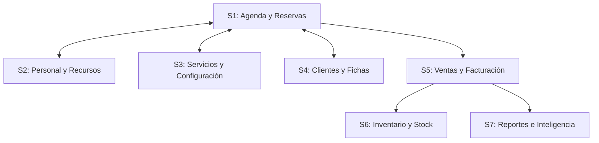

# Determinación de Límites - Studio Salta

Este documento detalla los límites del sistema de información de **Studio Salta** (Peluquería/Barbería), estructurando las fronteras del software, sus subsistemas lógicos y el flujo de información entre ellos. Se basa en las especificaciones del trabajo práctico (TP 4) y la implementación técnica real del código fuente (Django).

---

## 1. Límite Externo (Frontera del Sistema)

El límite externo delimita las responsabilidades del software frente a las operaciones manuales, físicas o externas del negocio.

### 📋 Funciones DENTRO del Sistema (Digitales)

Estas son las funciones que el sistema procesa, registra o resuelve digitalmente:

#### Gestión de Clientes
*   **Registrar cliente**: Alta de nuevos clientes en el sistema.
*   **Modificar cliente**: Edición de datos de contacto y preferencias.
*   **Deshabilitar cliente**: Baja lógica para conservar el historial transaccional sin mostrar al cliente inactivo.
*   **Reactivar cliente**: Restauración del estado de clientes previamente desactivados.
*   **Visualizar perfil integral del cliente**: Pantalla unificada con historial de visitas, servicios consumidos y fichas técnicas.

#### Gestión de Turnos y Reservas
*   **Agendar turno (interno)**: Reserva de turnos presenciales o telefónicos realizada por recepcionistas.
*   **Reservar turno público (online)**: Portal autogestionado para que los clientes reserven turnos en línea.
*   **Confirmar reserva pública**: Validación de turnos públicos mediante confirmación por correo electrónico (tokens de verificación).
*   **Modificar turno / Reprogramar turno**: Cambio de fecha, hora, profesional o servicio de una reserva activa.
*   **Cancelar turno (interno o público)**: Anulación del turno con liberación automática de los recursos reservados.
*   **Iniciar turno**: Registro operativo de que el cliente ha llegado y comenzó su atención.
*   **Calcular disponibilidad de horarios (API)**: Algoritmo en tiempo real que cruza horarios comerciales, bloqueos, agendas de profesionales y ocupación de estaciones de trabajo para ofrecer slots válidos.
*   **Enviar recordatorio de turno**: Notificaciones automatizadas de proximidad del turno.

#### Gestión del Personal y Recursos Físicos
*   **Agregar profesional**: Registro de empleados con sus habilidades o servicios asociados.
*   **Modificar profesional**: Edición de información del empleado.
*   **Deshabilitar/Reactivar profesional**: Baja lógica y recuperación de personal en la agenda.
*   **Agregar estación de trabajo**: Control de sillones de atención física disponibles.
*   **Modificar estación de trabajo**: Edición de datos de la estación.
*   **Deshabilitar/Reactivar estación de trabajo**: Control de uso y disponibilidad física de los sillones.

#### Servicios y Configuración Operativa
*   **Agregar/Modificar/Deshabilitar/Reactivar servicio**: Catálogo de prestaciones con sus precios base y duraciones estimadas.
*   **Reordenar servicios**: Configuración del orden de visualización de los servicios en la interfaz.
*   **Gestionar horarios de atención**: Establecer la franja horaria estándar de apertura y cierre por día de la semana.
*   **Gestionar cierres excepcionales**: Bloqueos temporales de agenda (vacaciones, feriados, etc.).

#### Ventas, Caja e Inventario
*   **Registrar venta de turno (Facturar)**: Proceso de cierre de un turno completado, registrando los importes y medios de pago.
*   **Registrar venta libre**: Venta directa en mostrador de productos o servicios sin turno previo.
*   **Registrar consumo de insumos**: Descuento automático o manual del stock de productos tras la prestación del servicio.
*   **Actualizar stock rápido**: Ajustes manuales del inventario por reposición o merma.
*   **Ajuste masivo de precios**: Actualización porcentual de precios del catálogo de productos.
*   **Agregar/Modificar/Deshabilitar/Reactivar insumo (producto)**: Catálogo de mercaderías para venta y consumo.

#### Reportes y Métricas Gerenciales
*   **Liquidar comisiones**: Cálculo automático de las ganancias de cada profesional según las ventas de sus turnos atendidos.
*   **Registrar recaudación diaria**: Cierre de caja e informes de caja diaria.
*   **Información gerencial y analítica**: reportes que agrupan ventas por método de pago, identifican los servicios más vendidos y grafican la evolución de facturación mensual.

---

### 🚫 Funciones FUERA del Sistema (Físicas/Externas)

Estas actividades ocurren en el plano físico o corresponden a sistemas externos, por lo que **no** son resueltas por el software:

*   **Realizar el corte de cabello o servicio físico**: El trabajo manual del estilista (corte, peinado, lavado, aplicación de químicos) queda fuera; el sistema solo gestiona su programación y cobro.
*   **Proveer físicamente los insumos**: El transporte y entrega física de los productos por parte de los proveedores.
*   **Procesamiento físico del pago**: La entrega de efectivo del cliente al cajero, o el paso de la tarjeta por el dispositivo POSNET (el sistema registra la confirmación de la venta, no procesa la pasarela de pago bancaria directa).

---

## 2. Límite Interno (Subsistemas)

El sistema de información se divide en **7 subsistemas lógicos**, cada uno orientado a un sub-objetivo de negocio específico que agrupa funciones cohesivas.

### S1: Agenda y Reservas
*   **Sub-objetivo**: Programar, coordinar y optimizar la asignación de turnos del salón garantizando el cálculo correcto de disponibilidad.
*   *Funciones*: Agendar turno, Modificar/Reprogramar turno, Cancelar turno, Iniciar turno, Reservar turno público, Confirmar reserva pública, Cancelar reserva pública, API de cálculo de disponibilidad de horarios, Enviar recordatorio.

### S2: Gestión del Personal y Recursos
*   **Sub-objetivo**: Administrar el personal capacitado y la infraestructura física (sillones/estaciones de trabajo) para habilitar las reservas del salón.
*   *Funciones*: Agregar/Modificar/Deshabilitar/Reactivar profesional, Agregar/Modificar/Deshabilitar/Reactivar estación de trabajo.

### S3: Catálogo de Servicios y Configuración Operativa
*   **Sub-objetivo**: Definir los servicios realizables, duraciones asociadas, esquemas de horarios comerciales y bloqueos por feriados o licencias.
*   *Funciones*: Agregar/Modificar/Deshabilitar/Reactivar servicio, Reordenar servicios, Gestionar horarios de atención, Gestionar cierres excepcionales.

### S4: Gestión de Clientes e Historial Técnico
*   **Sub-objetivo**: Controlar la base de datos de clientes, registrando sus historiales de visitas y fichas técnicas para garantizar un servicio seguro y de calidad.
*   *Funciones*: Agregar/Modificar/Deshabilitar/Reactivar cliente, Visualizar perfil de cliente, Registrar ficha técnica de coloración/tratamiento.

### S5: Ventas y Facturación
*   **Sub-objetivo**: Registrar los cobros de turnos y ventas directas en mostrador, controlando los métodos de pago elegidos por el cliente.
*   *Funciones*: Registrar venta de turno, Registrar venta libre, Registrar recaudación diaria.

### S6: Inventario y Control de Insumos
*   **Sub-objetivo**: Administrar el stock de productos de reventa y consumo profesional, actualizando automáticamente el stock por venta o de forma rápida manual.
*   *Funciones*: Agregar/Modificar/Deshabilitar/Reactivar insumo, Actualizar stock rápido, Ajuste masivo de precios, Registrar consumo de insumos.

### S7: Reportes e Inteligencia de Negocio
*   **Sub-objetivo**: Generar información analítica gerencial para la toma de decisiones y calcular liquidaciones de comisiones para el personal del salón.
*   *Funciones*: Liquidar comisiones, Análisis de evolución mensual, Ranking de servicios más vendidos, Agrupación de ventas por método de pago, Dashboard operativo.

---

## 3. Límite Intermedio (Interacciones)

Las relaciones y flujos de información que cruzan los límites de los subsistemas para cumplir funciones operativas del salón son:

| Subsistema Origen | Flujo de Datos / Información | Subsistema Destino | ...para cumplir la función (Observaciones) |
| :--- | :--- | :--- | :--- |
| **S3: Catálogo y Configuración** | Habilidades de profesionales, horarios de atención y cierres | **S1: Agenda y Reservas** | Calcular disponibilidad algorítmica de horarios de turnos en tiempo real. |
| **S1: Agenda y Reservas** | Datos de turno completado (profesional, cliente, servicios) | **S5: Ventas y Facturación** | Facturar el turno (vincular servicios agendados con la venta formal). |
| **S4: Clientes e Historial** | Datos de contacto y preferencias de alerta del cliente | **S1: Agenda y Reservas** | Enviar recordatorio de turno y habilitar autogestión pública. |
| **S5: Ventas y Facturación** | Detalle de productos vendidos e insumos utilizados en el servicio | **S6: Inventario (Stock)** | Registrar consumo de insumos y reducir existencias (stock) automáticamente. |
| **S5: Ventas y Facturación** | Ventas totales imputadas a profesionales en un rango de fechas | **S7: Reportes y Liquidaciones** | Liquidar comisiones correspondientes a cada profesional y armar el Dashboard. |
| **S1: Agenda y Reservas** | Datos de turno activo al que se le aplicará un servicio de coloración | **S4: Clientes e Historial** | Registrar ficha técnica de coloración vinculada a un cliente. |
