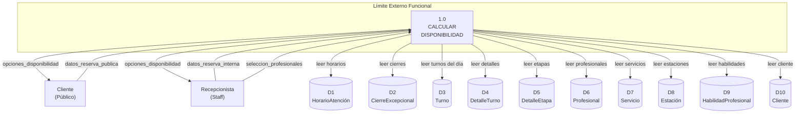
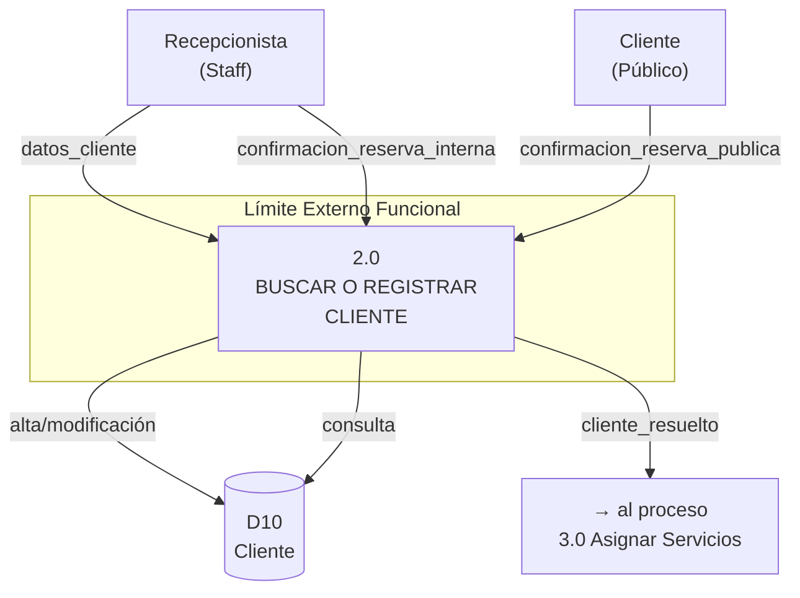
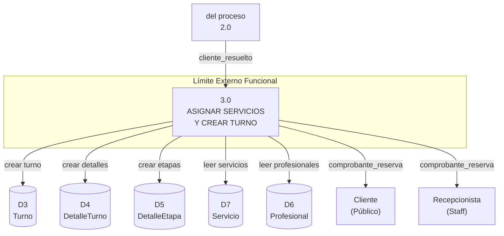

# TP N°6: Modelo del Comportamiento

**Sistema:** Studio Salta — Peluquería/Barbería  
**Funcionalidad:** Registrar Nuevo Turno  
**Técnicas:** DFD (Partición por Acontecimientos) + Est.Tab (Estado/Tablas)

---

## Lista de Eventos (LE) Vinculada

Los siguientes eventos de la LE son los que activan el registro de un nuevo turno, tanto por la vía interna (recepcionista) como pública (cliente web):

| N° LE | Entidad | Evento | Flujo Entrada | Flujo Salida |
|-------|---------|--------|---------------|--------------|
| **1.1** | Cliente | Solicita reservar turno/s ingresando datos y seleccionando servicios | `datos_reserva_publica` | `opciones_disponibilidad` |
| **1.2** | Cliente | Selecciona profesionales para cada servicio | `seleccion_profesionales` | `opciones_disponibilidad` |
| **1.3** | Cliente | Confirma la reserva eligiendo horario | `confirmacion_reserva_publica` | `comprobante_reserva` |
| **2.5** | Recepcionista | Agenda turno interno (presencial/telefónico) | `datos_reserva_interna` | `opciones_disponibilidad` |
| **2.6** | Recepcionista | Confirma asignación del turno interno | `confirmacion_reserva_interna` | `comprobante_reserva` |

---

## Límite Externo Funcional (Lím.Ext.FD)

Cada DFD(PxA) representa una funcionalidad puntual dentro del Límite Externo del sistema. El Límite Externo de Studio Salta fue definido en el TP4 e incluye digitalmente: gestión de turnos, clientes, profesionales, servicios, estaciones, ventas e inventario. Quedan fuera del sistema: la ejecución física del servicio de peluquería y el procesamiento físico del pago.

---

## DFD(PxA) N°1 — BÁSICO: Calcular Disponibilidad

> **Vinculado a:** Eventos 1.1, 1.2 y 2.5 de la LE  
> **Complejidad:** Básica — proceso de **solo lectura** que consulta 1 tabla principal (Turno) + tablas referenciadas  
> **Propósito:** Dados una fecha, cliente y conjunto de servicios con profesionales (fijos u opcionales), calcular las secuencias horarias contiguas válidas ordenadas por mejor score.

### Diagrama



### Diccionario de Datos (DD) — Flujos del DFD N°1

(Se transcriben de la LE únicamente los flujos que aparecen en este diagrama)

#### Flujos de Entrada

**`datos_reserva_publica`** (desde EE1 — Cliente)

```
datos_reserva_publica = nombre_cliente + apellido_cliente + telefono_cliente
                        + email_cliente + {id_servicio_seleccionado}
                        + [observaciones] + [horario_preferido]
```

| Campo | Tipo | Obligatorio | Descripción |
|-------|------|:-----------:|-------------|
| `nombre_cliente` | Alfanumérico (100) | Sí | Nombre del cliente |
| `apellido_cliente` | Alfanumérico (100) | Sí | Apellido del cliente |
| `telefono_cliente` | Alfanumérico (20) | No | Teléfono de contacto |
| `email_cliente` | Email | No | Correo electrónico |
| `id_servicio_seleccionado` | Entero {1,N} | Sí | ID de cada servicio seleccionado |
| `observaciones` | Texto libre | No | Observaciones adicionales |
| `horario_preferido` | Hora (HH:MM) | No | Horario preferido para búsqueda radial |

---

**`seleccion_profesionales`** (desde EE1 — Cliente)

```
seleccion_profesionales = {id_servicio + id_profesional_elegido}
```

| Campo | Tipo | Obligatorio | Descripción |
|-------|------|:-----------:|-------------|
| `id_servicio` | Entero | Sí | ID del servicio |
| `id_profesional_elegido` | Entero \| NULL | Sí | ID del profesional elegido. NULL = "Cualquiera" |

---

**`datos_reserva_interna`** (desde EE2 — Recepcionista)

```
datos_reserva_interna = id_cliente + {id_servicio_seleccionado}
                        + {id_profesional_elegido} + fecha_deseada
                        + [horario_preferido] + [observaciones]
```

| Campo | Tipo | Obligatorio | Descripción |
|-------|------|:-----------:|-------------|
| `id_cliente` | Entero | Sí | Cliente seleccionado (por búsqueda) |
| `id_servicio_seleccionado` | Entero {1,N} | Sí | Servicios elegidos |
| `id_profesional_elegido` | Entero \| NULL {1,N} | Sí | Profesional por servicio (NULL = cualquiera) |
| `fecha_deseada` | Fecha (AAAA-MM-DD) | Sí | Fecha del turno |
| `horario_preferido` | Hora (HH:MM) | No | Horario preferido |
| `observaciones` | Texto libre | No | Observaciones del turno |

#### Flujos de Salida

**`opciones_disponibilidad`** (hacia EE1 y EE2)

```
opciones_disponibilidad = {opcion_horaria} + [alternativas]
```

```
opcion_horaria = id_opcion + hora_inicio + hora_fin_estimada + score
                 + {servicio + profesional_asignado + estacion_asignada
                    + hora_inicio_servicio + hora_fin_servicio}
                 + es_mejor_opcion
```

| Campo | Tipo | Descripción |
|-------|------|-------------|
| `id_opcion` | Entero | Identificador de la opción |
| `hora_inicio` | Hora (HH:MM) | Inicio de la secuencia completa |
| `hora_fin_estimada` | Hora (HH:MM) | Fin estimado de todos los servicios |
| `score` | Entero | Puntaje de calidad (mayor = mejor) |
| `servicio` | Texto | Nombre del servicio |
| `profesional_asignado` | Texto | Profesional asignado |
| `estacion_asignada` | Texto | Estación asignada |
| `hora_inicio_servicio` | Hora | Inicio del servicio individual |
| `hora_fin_servicio` | Hora | Fin del servicio individual |
| `es_mejor_opcion` | Booleano | Mejor opción con mejor puntaje (⭐) |
| `alternativas` | Lista {0,8} | Opciones con otros profesionales |

### Est.Tab N°1 — Estado/Tablas de Calcular Disponibilidad

| Evento LE | Estímulo | Entidad Externa | Proceso | Flujo Entrada | Tablas Leídas | Flujo Salida |
|-----------|----------|-----------------|---------|---------------|---------------|--------------|
| **1.1** | Cliente solicita reservar turno/s | Cliente (EE1) | 1.0 Calcular Disponibilidad | `datos_reserva_publica` | D1 HorarioAtención, D2 CierreExcepcional, D3 Turno, D4 DetalleTurno, D5 DetalleEtapa, D6 Profesional, D7 Servicio, D8 Estación, D9 HabilidadProfesional, D10 Cliente | `opciones_disponibilidad` |
| **1.2** | Cliente selecciona profesionales | Cliente (EE1) | 1.0 Calcular Disponibilidad | `seleccion_profesionales` | D3 Turno, D4 DetalleTurno, D5 DetalleEtapa, D6 Profesional, D7 Servicio, D8 Estación, D9 HabilidadProfesional | `opciones_disponibilidad` |
| **2.5** | Recepcionista agenda turno interno | Recepcionista (EE2) | 1.0 Calcular Disponibilidad | `datos_reserva_interna` | D1 HorarioAtención, D2 CierreExcepcional, D3 Turno, D4 DetalleTurno, D5 DetalleEtapa, D6 Profesional, D7 Servicio, D8 Estación, D9 HabilidadProfesional, D10 Cliente | `opciones_disponibilidad` |

> **Nota de balanceo:** Todos los flujos de entrada y salida de esta Est.Tab están definidos en el DD de la LE y se corresponden 1:1 con los flujos del DFD(PxA) N°1.

---

## DFD(PxA) N°2 — BÁSICO: Buscar o Registrar Cliente

> **Vinculado a:** Eventos 1.3 y 2.6 de la LE  
> **Complejidad:** Básica — proceso que interactúa principalmente con **1 tabla (Cliente)**  
> **Propósito:** Antes de crear un turno, verificar si el cliente existe por DNI, y si no, crearlo con los datos de contacto ingresados. Si existe y se actualizaron datos, modificarlos.

### Diagrama



> El flujo `cliente_resuelto` es interno y pasa al proceso 3.0. Incluye `id_cliente` + datos de contacto actualizados.

### Diccionario de Datos (DD) — Flujos del DFD N°2

**`datos_cliente`** (desde EE2 — Recepcionista, por Evento 2.1 pero REUTILIZADO aquí)

```
datos_cliente = nombre + apellido + [telefono] + [email]
```

| Campo | Tipo | Obligatorio | Descripción |
|-------|------|:-----------:|-------------|
| `nombre` | Alfanumérico (100) | Sí | Nombre del cliente |
| `apellido` | Alfanumérico (100) | Sí | Apellido del cliente |
| `telefono` | Alfanumérico (20) | No | Teléfono de contacto |
| `email` | Email | No | Correo electrónico |

---

**`confirmacion_reserva_publica`** (desde EE1 — Cliente)

```
confirmacion_reserva_publica = id_opcion_horaria_elegida
                               + nombre_cliente + apellido_cliente
                               + telefono_cliente + [email_cliente]
                               + [observaciones]
```

| Campo | Tipo | Obligatorio | Descripción |
|-------|------|:-----------:|-------------|
| `id_opcion_horaria_elegida` | Entero | Sí | Opción de horario seleccionada |
| `nombre_cliente` | Alfanumérico (100) | Sí | Nombre del cliente |
| `apellido_cliente` | Alfanumérico (100) | Sí | Apellido del cliente |
| `telefono_cliente` | Alfanumérico (20) | No | Teléfono de contacto |
| `email_cliente` | Email | No | Correo electrónico |
| `observaciones` | Texto libre | No | Observaciones de la reserva |

---

**`confirmacion_reserva_interna`** (desde EE2 — Recepcionista)

```
confirmacion_reserva_interna = id_opcion_horaria_elegida + id_cliente + [observaciones]
```

| Campo | Tipo | Obligatorio | Descripción |
|-------|------|:-----------:|-------------|
| `id_opcion_horaria_elegida` | Entero | Sí | Opción de disponibilidad elegida |
| `id_cliente` | Entero | Sí | Cliente asociado |
| `observaciones` | Texto libre | No | Observaciones adicionales |

### Est.Tab N°2 — Estado/Tablas de Buscar o Registrar Cliente

| Evento LE | Estímulo | Entidad Externa | Proceso | Flujo Entrada | Tablas Afectadas | Tablas Leídas | Flujo Salida |
|-----------|----------|-----------------|---------|---------------|------------------|---------------|--------------|
| **1.3** | Cliente confirma reserva | Cliente (EE1) | 2.0 Buscar o Registrar Cliente | `confirmacion_reserva_publica` | D10 Cliente (INSERT o UPDATE) | D10 Cliente (SELECT por DNI) | `cliente_resuelto` (→ P3) |
| **2.6** | Recepcionista confirma asignación | Recepcionista (EE2) | 2.0 Buscar o Registrar Cliente | `confirmacion_reserva_interna` | D10 Cliente (UPDATE si cambió datos) | D10 Cliente (SELECT por id) | `cliente_resuelto` (→ P3) |

---

## DFD(PxA) N°3 — M:N: Asignar Servicios al Turno (DetalleTurno)

> **Vinculado a:** Eventos 1.3 y 2.6 de la LE  
> **Complejidad:** Intermedia — agrega tuplas en una tabla **M:N** (DetalleTurno relaciona Turno ↔ Servicio) y su tabla derivada DetalleEtapa  
> **Propósito:** Crear el registro del Turno como cabecera y asignar cada servicio seleccionado como un DetalleTurno, con sus respectivos DetalleEtapa (asignación de estación por etapa).

### Diagrama



### Diccionario de Datos (DD) — Flujos del DFD N°3

**`comprobante_reserva`** (hacia EE1 y EE2)

```
comprobante_reserva = nro_reserva + token_magic_link + fecha_creacion
                      + nombre_cliente + {detalle_turno_confirmado}
                      + enlace_whatsapp + enlace_autogestión
```

```
detalle_turno_confirmado = nro_turno + servicio + profesional
                           + fecha_hora + hora_fin_estimada + estacion
```

| Campo | Tipo | Descripción |
|-------|------|-------------|
| `nro_reserva` | Entero | Número del turno creado |
| `token_magic_link` | UUID v4 | Token de autogestión para el cliente |
| `fecha_creacion` | DateTime | Momento en que se registró el turno |
| `nombre_cliente` | Texto | Nombre del cliente |
| `nro_turno` | Entero | ID del DetalleTurno |
| `servicio` | Texto | Nombre del servicio |
| `profesional` | Texto | Profesional asignado |
| `fecha_hora` | DateTime | Fecha y hora del turno |
| `hora_fin_estimada` | DateTime | Hora estimada de finalización |
| `estacion` | Texto | Estación donde se realiza |
| `enlace_whatsapp` | URL | Link para compartir por WhatsApp |
| `enlace_autogestión` | URL | Link al portal de autogestión |

### Est.Tab N°3 — Estado/Tablas de Asignar Servicios (M:N)

| Evento LE | Estímulo | Entidad Externa | Proceso | Flujo Entrada | Tablas Afectadas | Tablas Leídas | Flujo Salida |
|-----------|----------|-----------------|---------|---------------|------------------|---------------|--------------|
| **1.3** | Cliente confirma reserva | Cliente (EE1) | 3.0 Asignar Servicios y Crear Turno | `cliente_resuelto` (desde P2) + `opcion_horaria_elegida` | **D3 Turno** (INSERT), **D4 DetalleTurno** (INSERT x servicio), **D5 DetalleEtapa** (INSERT x etapa/servicio) | D7 Servicio, D6 Profesional | `comprobante_reserva` |
| **2.6** | Recepcionista confirma asignación | Recepcionista (EE2) | 3.0 Asignar Servicios y Crear Turno | `cliente_resuelto` (desde P2) + `opcion_horaria_elegida` | **D3 Turno** (INSERT), **D4 DetalleTurno** (INSERT x servicio), **D5 DetalleEtapa** (INSERT x etapa/servicio) | D7 Servicio, D6 Profesional | `comprobante_reserva` |

---

## Tabla de Correspondencia DFD(PxA) → LE → Est.Tab

| N° DFD(PxA) | Nombre del Proceso | Eventos LE | Est.Tab Vinculada |
|:-----------:|--------------------|:----------:|:-----------------:|
| 1.0 | Calcular Disponibilidad | 1.1, 1.2, 2.5 | N°1 |
| 2.0 | Buscar o Registrar Cliente | 1.3, 2.6 | N°2 |
| 3.0 | Asignar Servicios y Crear Turno | 1.3, 2.6 | N°3 |

Los DFD(PxA) N°2 y N°3 operan en cadena (el flujo de salida `cliente_resuelto` de P2 alimenta a P3), conformando el proceso completo de confirmación de la reserva.

---

## DER Derivado de las Est.Tab

De las Est.Tab N°1, N°2 y N°3 se identifican las siguientes entidades que conformarán el futuro DER:

| Entidad | Tipo | Descripción |
|---------|------|-------------|
| **Cliente** | Entidad fuerte | Datos personales del cliente |
| **Turno** | Entidad fuerte | Cabecera del agendamiento |
| **DetalleTurno** | Entidad intermedia M:N | Relaciona Turno ↔ Servicio (con profesional y precio real) |
| **DetalleEtapa** | Entidad intermedia | Relaciona DetalleTurno ↔ EtapaServicio (con estación asignada) |
| **Servicio** | Entidad fuerte | Catálogo de prestaciones |
| **EtapaServicio** | Entidad dependiente | Fases de un servicio |
| **Profesional** | Entidad fuerte | Personal del salón |
| **Estación** | Entidad fuerte | Recurso físico (sillón/lavacabeza/manicura) |
| **HorarioAtención** | Entidad fuerte | Franjas horarias del salón |
| **CierreExcepcional** | Entidad fuerte | Bloqueos temporales de agenda |
| **HabilidadProfesional** | Entidad intermedia M:N | Relaciona Profesional ↔ Servicio |

> **Nota:** Este DER preliminar se deriva directamente de las tablas identificadas en las Est.Tab de los DFD(PxA). El DER completo se desarrollará en la siguiente etapa del TP.

---

*Documento generado para TP N°6 — Modelo del Comportamiento*  
*Sistema: Studio Salta — Funcionalidad: Registrar Nuevo Turno*
